<div align="center">


<br>
<br>

**SentinelRAG** is an enterprise-ready Retrieval-Augmented Generation (RAG) framework designed with a "Security-First" philosophy. It solves the critical gap in standard RAG implementations: **the lack of document-level permissions and data privacy.**

*Because your AI shouldn't know more than your employees do.*


[](https://github.com/astral-sh/uv)
[](https://www.python.org/downloads/)
[](https://pydantic.dev)

[](https://github.com/rajeshtechforge)

<p align="center">
  <a href="https://github.com/RajeshTechForge/Sentinel-RAG/stargazers">
    
  </a>
</p>

[Key Features](https://www.google.com/search?q=%23-key-features) • [Architecture](https://www.google.com/search?q=%23-architecture) • [Getting Started](https://www.google.com/search?q=%23-getting-started) • [Roadmap](https://www.google.com/search?q=%23-roadmap)

</div>

---

## 🎯 The Challenge

**The "Intern vs. CEO" Problem**

Standard RAG systems treat all indexed documents as a flat pool of data. If an intern asks the system about executive compensation or private strategy decks, a typical RAG will happily retrieve that sensitive context.

**SentinelRAG** introduces a middleware layer that enforces:

1. **RBAC at Retrieval:** Filters vector search results based on the user's roles.
2. **PII Redaction:** Automatically masks sensitive entities (SSNs, Emails, API Keys) before they reach the LLM or the user.
3. **Immutable Audit Logs:** Tracks every query, the documents retrieved, and the roles used for full compliance (GDPR/HIPAA).


## ✨ Key Features

### 🔐 Multi-Tenant RBAC

* **Metadata Filtering:** Injects role-based filters directly into the Vector DB query.
* **Scoped Context:** Ensures the LLM only "sees" what the user is permitted to see.

### 🛡️ Privacy & Compliance

* **Automated PII Scrubbing:** Integrated sanitization layer for both input queries and output responses.
* **Auditability:** Comprehensive logging to PostgreSQL for forensic analysis and usage monitoring.

### ⚡ Modern Python Stack

* **FastAPI & Pydantic v2:** High-performance, type-safe asynchronous API.
* **Powered by `uv`:** Lightning-fast dependency management and reproducible builds.
* **Flexible Vector Backends:** Native support for `pgvector`, with Qdrant integration on the roadmap.


## 🏗️ Architecture

```mermaid
flowchart TD
    subgraph Client ["🖥️ Client Layer"]
        User[👤 User / App]
    end

    subgraph Security_Gate ["🛡️ Sentinel Middleware"]
        Auth[🔑 Auth & Role Extractor]
        RBAC_Filter[⚖️ Dynamic Filter Generator]
        PII_Proc[🔏 PII Redaction: Post-Retrieval]
    end

    subgraph Knowledge_Base ["🗄️ Secure Vector Store"]
        VDB[(pgvector / Qdrant)]
    end

    subgraph Intelligence ["🤖 Inference Engine"]
        LLM[LLM: Local / Cloud]
    end

    %% Flow logic
    User -->|1. Authenticated Query| Auth
    Auth -->|2. Scoped Metadata| RBAC_Filter
    RBAC_Filter -->|3. Filtered Search| VDB
    VDB -->|4. Raw Context| PII_Proc
    Auth -.->|5. Original Query| PII_Proc
    PII_Proc -->|6. Clean Query + Context| LLM
    LLM -->|7. Sanitized Response| User

```




## 🚀 Getting Started

SentinelRAG utilizes [uv](https://github.com/astral-sh/uv) for high-speed dependency resolution.

### 1. Installation

```bash
# Clone the repository
git clone https://github.com/RajeshTechForge/sentinel-rag.git
cd sentinel-rag

# Install dependencies and create environment
uv sync

```

### 2. Configuration

Create a `.env` file based on the example:

```bash
cp .env.example .env

```

Define your structure in your `config.json`:

```json
{
    "DEPARTMENTS": ["finance", "hr", "engineering", "sales", "marketing"],
    "ROLES": {
        "finance": ["accountant", "financial_analyst"],
        "hr": ["recruiter", "hr_manager"],
    },
    "ACCESS_MATRIX": {
        "public": {
            "finance": ["accountant", "financial_analyst"],
        },
        "internal": {},
        "confidential": {}
    }
}

```

### 3. Launch the API

```bash
uv run uvicorn sentinel_rag.api.app:app --reload

```


## 🛠️ Tech Stack

| Layer | Technology |
| --- | --- |
| **Language** | Python 3.10+ |
| **API Framework** | FastAPI (Async) |
| **Data Validation** | Pydantic v2 |
| **Package Manager** | uv |
| **Vector Search** | pgvector (PostgreSQL) |
| **Orchestration** | Docker & Docker Compose |


## 🗺️ Roadmap

* [x] Initial RBAC Logic for `pgvector`
* [x] PII Redaction Middleware
* [ ] Qdrant Vector DB Support
* [ ] Support for LLMs calls
* [ ] Admin Dashboard for Audit Log Visualization
* [ ] Multi-modal RAG support (Images/PDFs)


## 🤝 Contributing

We love contributors! Whether you are fixing a bug or suggesting a feature, please follow these steps:

1. **Fork** the repo and create your branch.
2. Ensure your code follows **PEP 8** and passes **Pyright/MyPy** checks.
3. Submit a **Pull Request** with a detailed description of changes.

Check out [Contributing Guidelines](https://www.google.com/search?q=CONTRIBUTING.md) for more details.


## 📄 License

Distributed under the **Apache License 2.0**. See [LICENSE](https://github.com/RajeshTechForge/Sentinel-RAG/blob/main/LICENSE.md) for more information.

---

<div align="center">
<p>Built with ❤️ for a more secure AI future.</p>
</div>
