<div align="center">


<br>
<br>

**Sentinel RAG** is an enterprise-ready RAG framework designed with "Security-First" philosophy. It solves the critical gap in standard RAG implementations: **lack of document-level permissions and data privacy.**

*The "Security-First" RAG Framework for Modern Enterprises*


<p align="center">
  <a href="https://github.com/RajeshTechForge/sentinel-rag/stargazers">
    
  </a>
</p>

[Key Features](#-key-features) • [Architecture](#-architecture) • [Getting Started](#-getting-started)

</div>

---

## 🎯 The Challenge

**The "Intern vs. CEO" Problem**

Most RAG implementations treat your knowledge base as a flat file system. When an LLM retrieves context, it doesn't know—or care—who is asking. This leads to critical data leaks: **an intern's query shouldn't trigger the retrieval of the CEO’s payroll data.**

**Sentinel RAG** acts as a secure proxy between your users and your data. It ensures that your AI only "knows" what the specific user is authorized to see, while stripping sensitive PII before it ever hits the inference engine.


## ✨ Key Features

- ⚖️ **Contextual Role-Based Access Control(RBAC):** Unlike standard vector searches, Sentinel RAG injects **dynamic metadata filters** into the retrieval process. It matches the user's JWT/Session roles against document-level permissions in real-time.

- 🛡️ **Automated PII Sanitization:** Built-in middleware automatically detects and masks sensitive entities using high-performance regex and NER (Named Entity Recognition) models before context is sent to the LLM.

- 🔐 **Enterprise-Ready Authentication** Single-tenant OIDC authentication with JWT-based authorization, supporting both cookie (browser) and Bearer token (API) authentication methods.

- 📝 **Immutable Compliance Logging:** Every request is audited. Sentinel RAG logs the user identity, the specific document chunks retrieved, and the sanitized prompt, providing a full trail for GDPR, HIPAA, and SOC2 compliance.

### ⚡ Performance-First Stack

* **FastAPI & Pydantic v2:** Fully asynchronous, type-safe API.
* **`uv` Powered:** Lightning-fast dependency management and reproducible environments.
* **Vector Agnostic:** Native support for `pgvector`, with Qdrant integration on the roadmap.


## 🏗️ Architecture

```mermaid
flowchart TD
    subgraph Client ["🖥️ Client Layer"]
        User[👤 User / App]
    end

    subgraph Security_Gate ["🛡️ Sentinel Middleware"]
        Auth[🔑 Auth Extractor]
        RBAC_Filter[⚖️ Dynamic Filter Generator]
        PII_Proc[🔏 PII Redaction: Post-Retrieval]
    end

    subgraph Knowledge_Base ["🗄️ Secure Vector Store"]
        VDB[(pgvector / Qdrant)]
    end

    subgraph Intelligence ["🤖 Inference Engine"]
        LLM[LLM: Local / Cloud]
    end

    %% Flow logic
    User -->|1. Authenticated Query| Auth
    Auth -->|2. Scoped Metadata| RBAC_Filter
    RBAC_Filter -->|3. Filtered Search| VDB
    VDB -->|4. Raw Context| PII_Proc
    Auth -.->|5. Original Query| PII_Proc
    PII_Proc -->|6. Clean Query + Context| LLM
    LLM -->|7. Sanitized Response| User

```




## 🚀 Getting Started

Sentinel RAG offers two setup options: **Docker** (recommended for quick setup) or **local installation** with `uv`.

### Using Docker (Recommended)

The fastest way to get Sentinel RAG running with all dependencies pre-configured.

#### 1. Clone, Config & Launch

```bash
# Clone the repository
git clone https://github.com/RajeshTechForge/sentinel-rag.git
cd sentinel-rag

# Create a `.env` file based on example
cp .env.example .env

# Build and start all services
docker compose up --build
```

> This start sentinel-rag api on port `8000`

### Local Setup

Sentinel RAG utilizes [uv](https://github.com/astral-sh/uv) for high-speed dependency resolution.

#### 1. Installation

```bash
# Clone the repository
git clone https://github.com/RajeshTechForge/sentinel-rag.git
cd sentinel-rag

# Install dependencies and create environment
uv sync
# Install in editable mode
uv python install -e .
```

#### 2. Configuration

Create a `.env` file based on the example:

```bash
cp .env.example .env
```

#### 3. Launch the API

```bash
uv run uvicorn sentinel_rag.api.app:app --reload

```

> [!IMPORTANT]
> Using Python 3.14 may cause compatibility issues due to using Pydantic v2. It is recommended to use Python 3.10 - 3.13.


## 🛠️ Tech Stack

| Layer | Technology |
| --- | --- |
| **Language** | Python 3.10 - 3.13 |
| **API Framework** | FastAPI (Async) |
| **Data Validation** | Pydantic v2 |
| **Package Manager** | uv |
| **Vector Search** | pgvector (PostgreSQL) |
| **Orchestration** | Docker & Docker Compose |

> [!NOTE]
> The system currently utilizes LangChain's FakeEmbeddings for demonstration purposes.


## 📚 Documentations

- [API Guide](docs/API_GUIDE.md)
- [CONFIGURATION Guide](docs/CONFIGURATION.md)
- [COMPLIANCE Guide](docs/COMPLIANCE.md)
- [CONTRIBUTING Guidelines](CONTRIBUTING.md)


## 🤝 Contributing

We love contributors! Whether you are fixing a bug or suggesting a feature.  
Check out [Contributing Guidelines](CONTRIBUTING.md) for more details.


## 📄 License

Distributed under the **Apache License 2.0**. See [LICENSE](LICENSE.md) for more information.

---

<div align="center">
<p>Built with ❤️ for a more secure AI future.</p>
</div>
