<div align="center">


<br>
<br>

**Enterprise-Grade RAG with Role-Based Access Control & PII Protection**

*Because your AI shouldn't know more than your employees do.*


[](https://github.com/astral-sh/uv)
[](https://www.python.org/downloads/)
[](https://pydantic.dev)

[](https://github.com/rajeshtechforge)

<p align="center">
  <a href="https://github.com/RajeshTechForge/Sentinel-RAG/stargazers">
    
  </a>
</p>

[Features](#-key-features) • [Getting Started](#-getting-started)

</div>


## 🎯 About

### The Problem

Companies have terabytes of internal data (PDFs, wikis, Slack logs) and want to use LLMs to query this knowledge. However, standard RAG (Retrieval Augmented Generation) systems have a critical flaw:

> **They treat all data equally.**

If an intern asks *"What are the executive salary bands?"*, a typical RAG system will retrieve and answer from any document in the vector database—**even if the intern shouldn't have access to it.**

This creates three major enterprise blockers:

- 🚨 **The "Intern vs. CEO" Problem**: No permission boundaries at retrieval time
- 🔓 **Data Leakage**: Sensitive PII accidentally sent to LLMs or returned to unauthorized users  
- 📋 **Compliance Gaps**: No audit trail of who accessed what data and when

### The Solution

**SentinelRAG** is a Role-Based Access Control based RAG system that enforces **document-level security**, *before* data reaches the LLM. It combines:

- [x] **Role-Based Access Control (RBAC)** at the vector search level  
- [x] **Automatic PII redaction** to prevent sensitive data leaks  
- [x] **Comprehensive audit logging** for compliance (GDPR, SOC 2, HIPAA)


## ✨ Key Features

### Security First

- **Dynamic Filtering**: Vector search queries are automatically filtered based on user roles and access level

- **PII Detection & Redaction**: Automatically sanitizes sensetive information (SSNs, emails, phone numbers) from queries and responses

### Developer Experience

- **FastAPI Backend**: High-performance async Python API
- **Fully Configurable**: File flags, Deperments, User role types and access level design, everything can be configurable according to need.


## 🏗️ Architecture

```mermaid
flowchart TD
    subgraph Client ["🖥️ Frontend"]
        User[👤 User: Junior Dev]
        Admin[👤 User: HR Manager]
    end

    subgraph Middleware ["⚙️ API Gateway (FastAPI)"]
        Auth[🔑 Auth Service JWT]
        PII_Filter[🛡️ PII Redaction Layer]
        Query_Engine[🔍 Query Construction]
    end

    subgraph Data_Layer ["🗄️ Vector Database (Qdrant)"]
        Public_Docs[📄 Public Docs]
        HR_Docs[📄 HR Restricted]
        Eng_Docs[📄 Engineering Restricted]
    end

    subgraph AI_Layer ["🤖 Inference"]
        LLM[🧠 LLM - OpenAI / Llama 3]
    end

    User -->|1. Query: 'What is the salary range?'| Auth
    Auth -->|2. Attach Role: 'role:junior_dev'| PII_Filter
    PII_Filter -->|3. Mask PII SSN/Names| Query_Engine
    
    Query_Engine -->|4. Vector Search + Filter: 'group IN public, dev'| Data_Layer
    
    Data_Layer -.->|5. ❌ BLOCKED: HR Docs| Query_Engine
    Data_Layer -->|5. ✅ ALLOWED: Public Docs| Query_Engine
    
    Query_Engine -->|6. Context + Sanitized Query| LLM
    LLM -->|7. Final Answer| User
```




## 🛠️ Tech Stack

| Component | Technology | Purpose |
|:----------|:-----------|:--------|
| **Backend** |   | High-performance async API framework |
| **Database** |  | Doument Data, Audit logs & user management |
| **Vector DB** | **PgVector** / **Qdrant**(Upcoming)| Open-source vector search with metadata filtering |
| **Deployment** |  | Containerized deployment |


## 🚀 Getting Started

Sentinel RAG uses `uv` for lightning-fast, reproducible dependency management.

### 1. Prerequisites

* **Python:** 3.10 or higher
* **Docker & Docker Compose** (Optional, for deployment)
* **PostgreSQL + PgVector** - *Ensure you have a running PostgreSQL instance with the PgVector extension installed.*

### 2. Quick Installation

First, ensure you have [uv installed](https://docs.astral.sh/uv/getting-started/installation/):

```bash
curl -LsSf https://astral.sh/uv/install.sh | sh

```

#### 2. Setup the Project

You don't need to create a virtualenv manually. Just run `sync` to install dependencies and the `sentinel_rag` package:

```bash
git clone https://github.com/RajeshTechForge/sentinel-rag.git
cd sentinel-rag
uv sync

```

### 3. Configuration

Sentinel RAG uses a layered configuration system. Copy the example environment file to get started:

```bash
cp .env.example .env

```

**Key Configuration Files:**

* `.env`: Local Database credentials and and Config file path.

To use a custom configuration, point to your file in the `.env`:
`SENTINEL_CONFIG_PATH=/path/to/your/rbac_config.json`

#### 4. Initialize and Run

Run your seeding script and start the API through the `uv` managed environment:

```bash
# Start the API
uv run uvicorn sentinel_rag.api.app:app --reload

```

---

## 🤝 Contributing

We welcome contributions! Here's how to get started:

1. **Fork the repository**
2. **Create a feature branch**: `git checkout -b feature/amazing-feature`
3. **Make your changes**: Follow the code style
4. **Use it**: Test your changes befor commiting
6. **Commit your changes**: `git commit -m 'feat: add amazing feature'`
7. **Push to the branch**: `git push origin feature/amazing-feature`
8. **Open a Pull Request**

### Development Guidelines

- **Commit Messages**: Follow [Conventional Commits](https://www.conventionalcommits.org/)
- **Documentation**: Update docstrings and README for new features
- **Security**: Never commit API keys or credentials


## 📄 License

This project is licensed under the Apache License 2.0 - see the [LICENSE](https://github.com/RajeshTechForge/Sentinel-RAG/blob/main/LICENSE.md) file for details.

---

<div align="center">
Made with ❤️ for enterprise AI security
</div>
